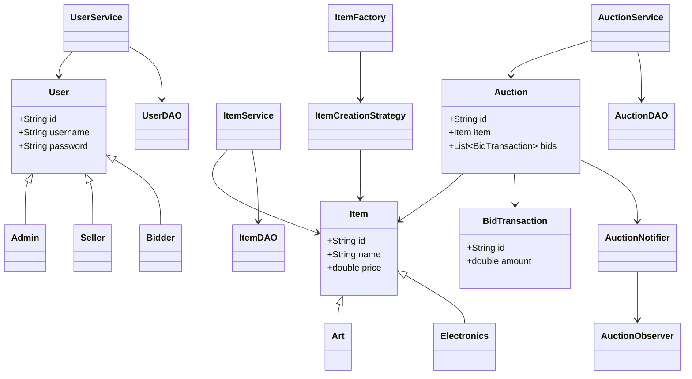

## 🧩 Class Diagram

```mermaid
classDiagram

%% ================= USER =================
class User {
  +String id
  +String username
  +String password
}

class Admin
class Seller
class Bidder

User <|-- Admin
User <|-- Seller
User <|-- Bidder

%% ================= ITEM =================
class Item {
  +String id
  +String name
  +double price
}

class Art
class Electronics

Item <|-- Art
Item <|-- Electronics

%% ================= AUCTION =================
class Auction {
  +String id
  +Item item
  +List~BidTransaction~ bids
}

class BidTransaction {
  +String id
  +double amount
}

Auction --> Item
Auction --> BidTransaction

%% ================= SERVICE =================
class UserService
class ItemService
class AuctionService

UserService --> User
ItemService --> Item
AuctionService --> Auction

%% ================= DAO =================
class UserDAO
class ItemDAO
class AuctionDAO

UserService --> UserDAO
ItemService --> ItemDAO
AuctionService --> AuctionDAO

%% ================= FACTORY =================
class ItemFactory
class ItemCreationStrategy

ItemFactory --> ItemCreationStrategy
ItemCreationStrategy --> Item

%% ================= OBSERVER =================
class AuctionObserver
class AuctionNotifier

AuctionNotifier --> AuctionObserver
Auction --> AuctionNotifier

```
